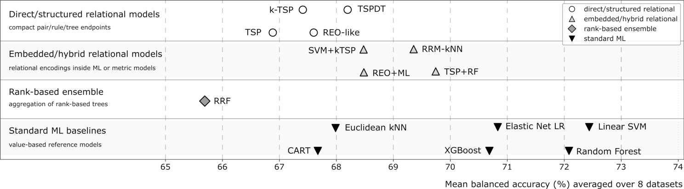

# Reproducibility-Oriented Benchmark for Rank-Based Relational Biomedical Modeling

Companion repository for:

**Rank-Based Relational Methods for Interpretable Biomedical Modeling: A Taxonomic Review**

This repository provides benchmark-ready data matrices, fixed cross-validation folds, executable method wrappers, final result tables, and figure-generation scripts for a reproducibility-oriented comparison of rank-based/relational methods and representative standard ML baselines.

<p align="center">
  
</p>

## Benchmark at a glance

| Component | Description |
|---|---|
| Primary protocol | `cv_5x5_f200` |
| Datasets | 8 public binary gene-expression datasets |
| Validation | 5 repeats × 5 folds |
| Feature filtering | train-fold-only MAD filtering |
| Feature count | 200 |
| Primary metric | balanced accuracy |
| Secondary metrics | macro-F1, MCC, accuracy |
| Completed final jobs | 3400 |
| Failed final jobs | 0 |
| Main result tables | `results/tables/` |
| Final figures | `figures/` |
| Final scripts | `scripts/final/` |

## What is included?

| Directory / file | Purpose |
|---|---|
| `data/final/` | Benchmark-ready feature matrices and labels |
| `data/folds/` | Fixed cross-validation fold definitions |
| `data/manifests/` | File manifests and fold summaries |
| `results/tables/` | Reviewer-friendly CSV/XLSX result tables |
| `results/summary/` | Final machine-readable benchmark summaries |
| `figures/` | Main benchmark overview figures |
| `scripts/final/` | Reproduction and figure-generation scripts |
| `QUICKSTART.md` | Minimal commands for checking and reproducing outputs |
| `DATA.md` | Dataset and preprocessing notes |
| `METHODS.md` | Method wrappers and benchmark method groups |
| `RESULTS.md` | Final benchmark-output overview |
| `REPRODUCIBILITY.md` | Reproducibility and environment notes |

## Method groups

| Group | Methods |
|---|---|
| Direct/structured relational models | TSP, k-TSP, REO-like, TSPDT |
| Embedded/hybrid relational models | SVM+kTSP, REO+ML, TSP+ML, RRM-kNN |
| Rank-based ensemble | RRF |
| Standard ML baselines | Elastic Net LR, Linear SVM, Euclidean kNN, Decision Tree, Random Forest, XGBoost |
| Sanity baseline | Majority classifier |

## Main benchmark summary

The table below reports the top methods by mean balanced accuracy across datasets under the shared `cv_5x5_f200` protocol. Full dataset-level results are available in `results/tables/final_dataset_method_summary.csv` and `results/tables/final_dataset_method_summary.xlsx`.

| Method | Group | Mean balanced accuracy (%) |
|---|---|---:|
| Linear SVM | Standard ML baselines | 72.44 |
| Random Forest | Standard ML baselines | 72.08 |
| Elastic Net LR | Standard ML baselines | 70.83 |
| XGBoost | Standard ML baselines | 70.69 |
| TSP+ML | Embedded/hybrid relational models | 69.74 |
| RRM-kNN | Embedded/hybrid relational models | 69.35 |
| SVM+kTSP | Embedded/hybrid relational models | 68.48 |
| REO+ML | Embedded/hybrid relational models | 68.48 |

## Quick start

Check the environment:

```bash
bash scripts/final/00_setup_check.sh
```

Regenerate the final summaries from completed fold-level outputs:

```bash
bash scripts/final/05_collect_final_results.sh
```

Regenerate figures:

```bash
python scripts/final/06_make_figures.py
```

If the repository is used inside the provided virtual environment, use:

```bash
.venv/bin/python scripts/final/06_make_figures.py
```

## Interpretation notes

This repository is a **reproducibility-oriented benchmark artifact**, not a definitive ranking of all relational methods.

Important caveats:

- the benchmark uses a shared feature-universe protocol rather than exhaustive method-specific tuning;
- standard ML baselines are included as reference points under the same train-fold-only preprocessing protocol;
- dataset-level variability should be inspected in the accompanying tables;
- REO and system-level rank-conservation methods often require different benchmark tasks and are not fully represented by cohort-level classification accuracy;
- the RRF result corresponds to the executable `ranktreeEnsemble::rforest` wrapper under the common `f200` protocol, not an exhaustive tuning study of the original method.

## Main outputs

- `results/tables/final_overall_summary.csv`
- `results/tables/final_overall_summary.xlsx`
- `results/tables/final_dataset_method_summary.csv`
- `results/tables/final_dataset_method_summary.xlsx`
- `figures/repo_benchmark_overview.png`
- `figures/repo_benchmark_overview.svg`

## Associated manuscript

This repository accompanies the manuscript currently under review:

> Czajkowski M., Jurczuk K., Kretowski M.  
> **Rank-Based Relational Methods for Interpretable Biomedical AI: A Taxonomic Review**.

A formal citation will be added after publication. For now, please cite or reference this repository when reusing the benchmark artifact.
